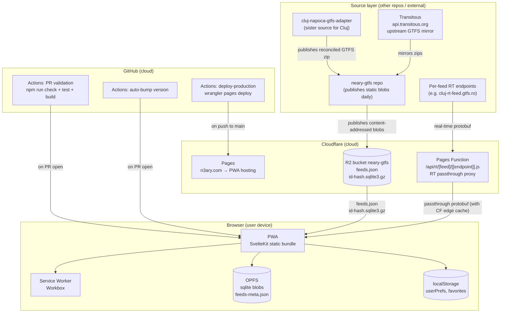

# Infrastructure

Every cloud / external / browser piece the app touches, in one diagram + one table. Cross-references the relevant specs/concepts for detail; this doc is the **index** for "what runs where and what breaks if it dies".

Cross-refs:
- Tech stack table — [stack.md](stack.md)
- Data flow (upstream → R2 → app → reconciler) — [data-pipeline.md](data-pipeline.md)
- CI / versioning / deploy — [../specs/ci-and-versioning.md](../specs/ci-and-versioning.md)
- PWA specifics (version polling, cache headers, safe-area) — [../specs/pwa.md](../specs/pwa.md)
- Storage lifecycle (OPFS eviction, pinning, offline) — [../specs/multi-feed-data-lifecycle.md](../specs/multi-feed-data-lifecycle.md)

## Diagram

## Component table

| Component | Role | Owner | Cost driver | Failure impact |
|---|---|---|---|---|
| **GitHub Actions — PR validation** | `npm run check` + `npm test` + `npm run build` on every PR | GitHub | Free tier (2 000 min/month) | PR can't merge |
| **GitHub Actions — auto-bump version** | Bumps `package.json#version` on every PR (skip when only `.github/**` changed) | GitHub | Free tier | Version drift; deploy reports wrong number |
| **GitHub Actions — deploy-production** | `wrangler pages deploy build --project-name=neary --branch=main` on push to `main` | GitHub + Cloudflare | Free tier + Wrangler invocation | Stale production; latest PRs not live |
| **Cloudflare Pages** | Static hosting for the PWA (`build/`) | Cloudflare | Free tier (unlimited requests on the free plan; Workers Paid $5/mo once Pages Functions are added) | PWA down |
| **Cloudflare Pages Function** — `/functions/api/rt/[feed]/[[endpoint]].js` | RT passthrough proxy: fetch `feeds.json`, look up upstream RT URL, fetch + return protobuf | Cloudflare | Workers Paid $5/mo + $0.30/M requests after 10 M | Live RT offline — UI shows schedule-only data |
| **Cloudflare R2** — `neary-gtfs` bucket | Stores `feeds.json` + `<id>-<hash12>.sqlite3.gz` | Cloudflare | $0.015/GB/month + $0.36/M Class A operations | App can't bootstrap (no manifest, no blobs) |
| **Custom domain** — `n3ary.com` → Pages | App URL | Cloudflare | Free with Pages | App URL down |
| **Custom domain** — `gtfs.n3ary.com` → R2 | Data URL | Cloudflare | Free with R2 | Data URL down |
| **neary-gtfs** (sister repo) | Builds + publishes the static blobs to R2 | [neary-gtfs repo](https://github.com/ciotlosm/neary-gtfs) | (its own infra — see its [architecture.md](https://github.com/ciotlosm/neary-gtfs/blob/main/docs/architecture/infrastructure.md)) | Data stale until upstream rebuilds |
| **cluj-napoca-gtfs-adapter** (sister repo) | Reconciled GTFS for Cluj (Transitous seed + Tranzy.ai + CTP CSVs) | [cluj-napoca-gtfs-adapter repo](https://github.com/ciotlosm/cluj-napoca-gtfs-adapter) | (its own infra) | Cluj data stale or missing |
| **Transitous** (`api.transitous.org`) | Upstream GTFS zip mirror for most feeds | Transitous | Free | Most feeds missing |
| **Per-feed RT endpoints** (e.g. `cluj-rt-feed.gtfs.ro`) | Live protobuf per operator | Operators | Free | Live view falls back to schedule-only for that feed |
| **Browser — PWA bundle** | The actual app | User device | Free | — |
| **Browser — Service Worker** (Workbox) | Asset caching + `_app/version.json` polling | User device | Free | PWA may serve stale assets after a deploy |
| **Browser — OPFS** | `feeds-meta.json` + per-feed `*.sqlite3` blobs | User device | Free | App can't load feeds (forces re-download on next launch) |
| **Browser — localStorage** | `userPrefs` (theme, feedId, toggles) + `favorites` per-feed | User device | Free | App may not remember settings between sessions |

## Planned: Hetzner RT adapter (tracking [neary-gtfs#34](https://github.com/ciotlosm/neary-gtfs/issues/34))

When the producer monorepo ships, the per-feed RT adapter will move to a Hetzner CX22 (€4.50/month fixed), with the existing Cloudflare Pages Function becoming a thin cache-and-passthrough layer in front. Spec:
[gtfs-rt-contract.md](../specs/gtfs-rt-contract.md). Until then, the existing Pages Function does the passthrough and the producer-side quirks live inline in [neary](https://github.com/ciotlosm/neary) via the TEMP `recoverClujTripFields` block in `src/lib/domain/enrichObservations.ts` (tracked by [#161](https://github.com/ciotlosm/neary/issues/161)).